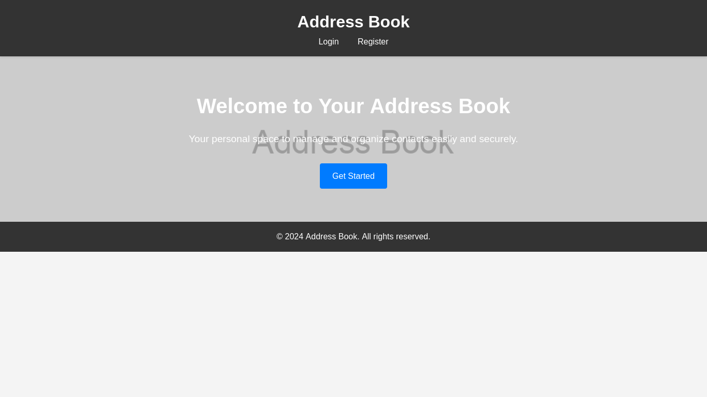

# AddressBook-in-php

**Language :**
> HTML CSS JAVASCRIPT PHP MYSQL


## Screenshot



**Instructions**

```address-book/
├── index.html
├── login.html
├── register.html
├── dashboard.html
├── logout.php
├── add_contact.php
├── delete_contact.php
├── get_contacts.php
├── db.php
├── styles.css
└── script.js

***************************************************************************************


1. Front-End (HTML & CSS):

    -index.html: Landing page.
    -login.html: Login page.
    -register.html: Registration page.
    -dashboard.html: User dashboard where they can manage contacts.
    -styles.css: Styling and animations for the website.

2. Back-End (PHP):

    db.php: Database connection.
    register.php: Handles user registration.
    login.php: Handles user login.
    logout.php: Logs out the user.
    add_contact.php: Adds a new contact.
    delete_contact.php: Deletes a contact.
    get_contacts.php: Retrieves contacts for the logged-in user.
4. JavaScript (script.js):

    Manages form submissions and dynamic updates for the contact list.
```

## SQL DATABASE COMMANDS
>> Copy this code and open phpyadmin and paste in the sql section and click go to create database and all tables

```
CREATE DATABASE address_book;

USE address_book;

-- Table for users
CREATE TABLE users (
    id INT AUTO_INCREMENT PRIMARY KEY,
    username VARCHAR(50) UNIQUE NOT NULL,
    password VARCHAR(255) NOT NULL
);

-- Table for contacts
CREATE TABLE contacts (
    id INT AUTO_INCREMENT PRIMARY KEY,
    user_id INT NOT NULL,
    name VARCHAR(100) NOT NULL,
    phone VARCHAR(15),
    email VARCHAR(100),
    FOREIGN KEY (user_id) REFERENCES users(id) ON DELETE CASCADE
);
```


